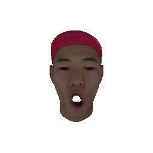

# 3D-Face-Deformation-

This project was developed as part of the **Topics in Artificial Intelligence** course at **Sapienza University of Rome**,  
Faculty of **Artificial Intelligence and Robotics**.

The objective of the project is to **transfer a facial expression from a target 3D face mesh to a neutral 3D face mesh**, producing a deformed model that replicates the target expression while preserving the identity and geometry of the neutral face.

---

## Results

A qualitative comparison between the input target expression and the resulting deformed neutral mesh is shown below:

  
  

**Left:** Target mesh with expression  
**Right:** Neutral mesh after deformation

